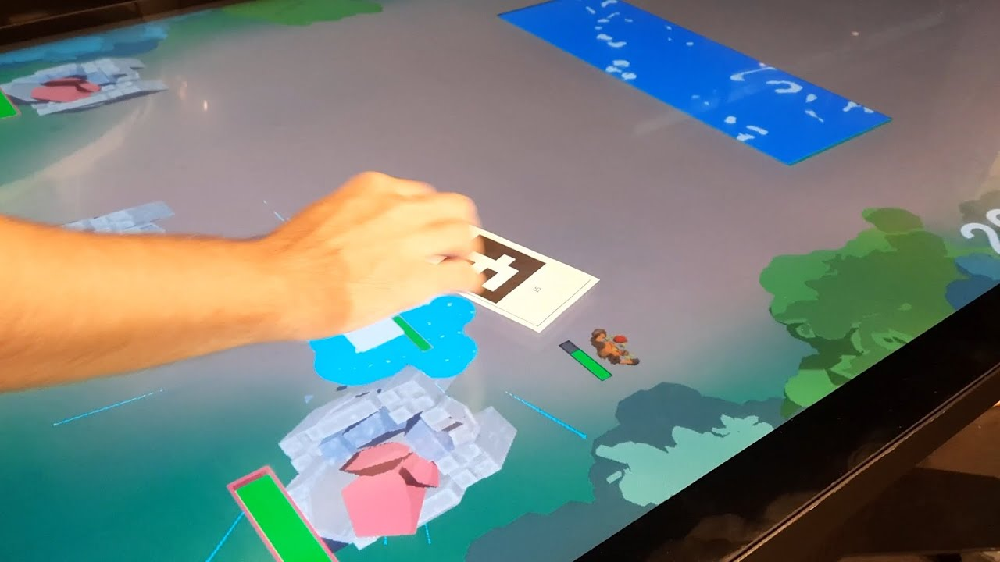
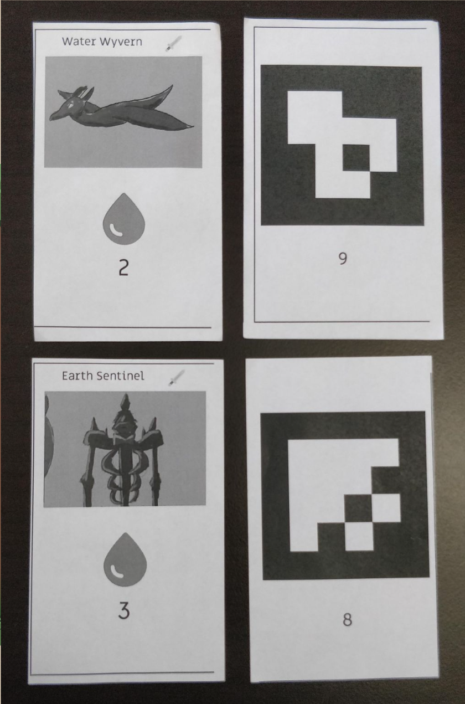
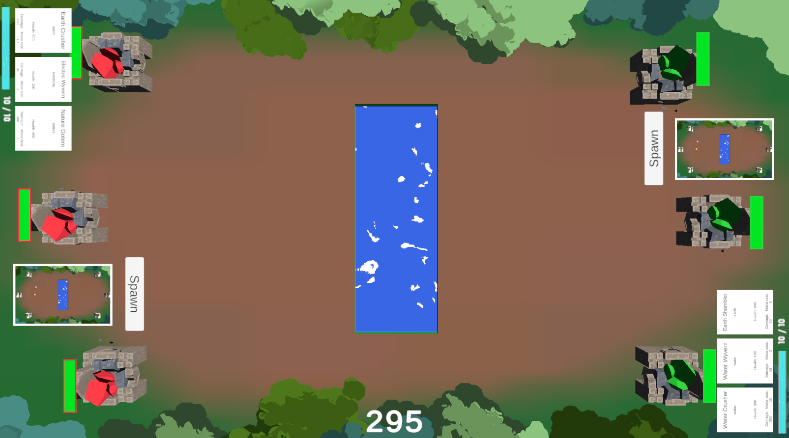
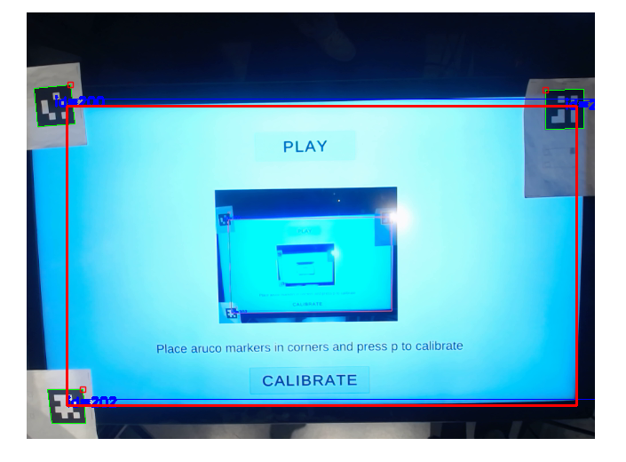

# Elemental Clash

## Overview
This project was done as part of my bachelors thesis in the course TNM094 at *Linköping University*. The goal of the project was to investigate how physical cards, played on a large touchscreen, can affect the pace of the game and the user's perceived stress, compared to digital cards. The project also investigated how the user experience was affected by using the physical cards compared to digital cards. To acomlplish this, we made a game where we could investigate the questions. The physical cards were made with ArUco markers to be able to translate cards in physical space to a position in the game space. The project and thesis was made together with *Emil Larsgärde*, *Ludwig Boge*, *Gayathri Naranath*, *Gustaf Kronholm*, *Armen Abedi* and *Mirijam Björn*.
****
## Current Features
- **Physical and Digital cards**: The game was played with either physical or digital cards, meaning you could either play with real cards in hand, or you could be playing with cards that were in the game. You could not use both at the same time.

- **A fully developed game-loop**: The game is fully developed, to the extent that the players can both choose settings before the game starts, press play, play until one player wins or both players draw, and then the game takes the player back to the state they so choose. The game is only developed with a very particular touch screen of 50 inches which can be found in the visualization centre in Norrköping, which is not accesible to the general public. Therefore, the game is not really playable anymore, since the screens are not availible to us anymore.

****
## Technologies Used
- **Unity**: An all purpose game engine which hosts powerfull tools for most usecases.
- **OpenCV**: The game utilizes camera vision to be able to identify both what the physical card being played coresponds to in the game, and also to translate real world coordinates to screen space coordinates.
****
## A small showcase of the project
### Image showing the spawning of a unit

### Image showing the physical cards that were used for the game

### Image showing the game screen

### Image showing the calibration that was done before the game to be able to translate world coordinates tom screen coordinates

### A trailer that we made for the project.
<video src="../../images/ElementalClash/Elemental Clash - Cardgame on Touchscreen With Physical Cards [TubeRipper.com].webm"></video>
**[Link](https://www.youtube.com/watch?v=-JwLrFs1Ud8&list=PPSV)** to the video with sound.
****

Here is the [Thesis](../../images/ElementalClash/KandidatProjekt_Rapport.pdf) for anybody interested! It is written in swedish as that was mandatory for the course. 
****

## [Back To Start Page](/)

