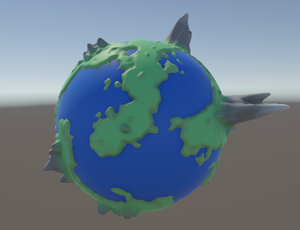
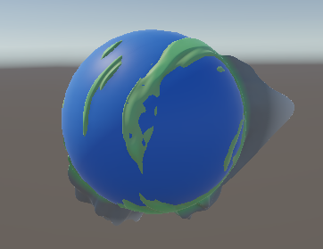
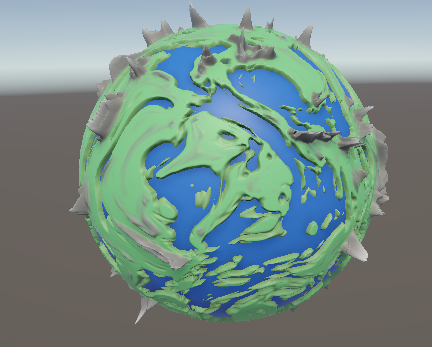
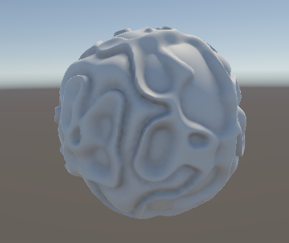
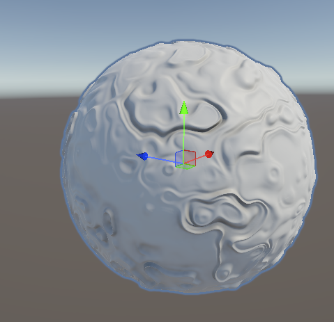
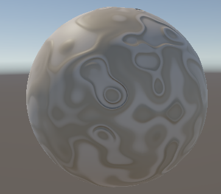
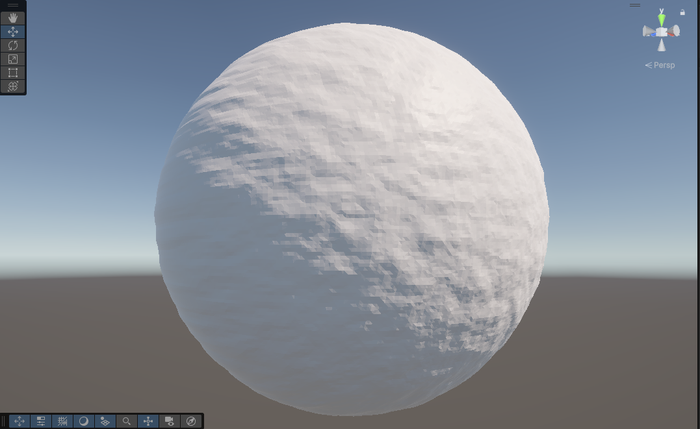
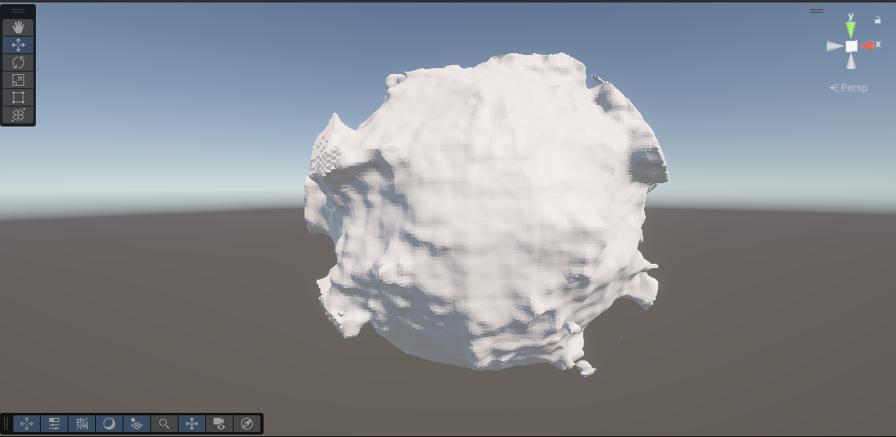

# Planet Generator

## Overview
A procedurall planet generator demo, which uses multiple types of noise functions from *patriciogonzalezvivo* on [GitHub](https://gist.github.com/patriciogonzalezvivo/670c22f3966e662d2f83), with a few changes to variable types to fit hlsl conventions as opposed to glsl. The current type of planets which can be generated are mountainous or desert, both with or without swizzling to create a more alien terrain.

## Current Features
- **Geometry setup**: The planets are all created using a subdivision algorithm of an icosahedron, which before subdivision has all vertices be at an uniform distance to all their neighbouring vertices, but sadly wont have that feature afterwards. Nevertheless, the resulting sphere has all vertices be at an nearly uniform distance from their neighbour, meaning that the terrain shaping wont cause distortion at the poles of the planet like some other more common and simpler sphere models.

- **Heightmap displacement on a spherical surface**: The 2D noise is saved in a buffer in a first pass of the shader, before being normalized between 0-1 in the second pass based on the highest and lowest value of the noise generated. Then a spline curve is sampled to create more extreme gradients to the gradient noise. The concept is something I got from [this lecture](https://youtu.be/ob3VwY4JyzE?t=1207) by *Henrik Kniberg*, one of the people working on the terrain for Minecrafts terrain update back in 2020. This technique helps shape flat land and oceans, while then also allowing for extreme mountains all with one noise map This can be seen in some of the images below.

## Technologies Used
- **Unity**: An all purpose game engine which hosts powerfull tools for most usecases.

### A showcase of the mountainous terrain

### A showcase of the desert planets

## Previous iterations of the project
- **Marching cubes algorithm**: The first iteration didn't initialize the planet with an icosphere. Instead, the planets were created using a voxel style approach which made voxels with a distance greater of 1 from the origin be air, and everything else be solid. The algorithm did create a nice looking sphere, and the resulting terrain after noise application was certainly interesting, but not what I was looking for. I also had to ask myself what the final result was going to look like, and came to the conclusion that the advantages of 3D noise is not usefull to the project (namely that it allows for things like overhangs in terrain, which would not be seen on a planetary scale). This led me to just work with 2D noise instead, as the results were not nearly as volitile. If I did ever revisit this project however, I would like to try and work further with 3D noise, as I have gotten more experience with it since.

### A quick showcase of the first iteration of the project

## [Back To Start Page](/)

