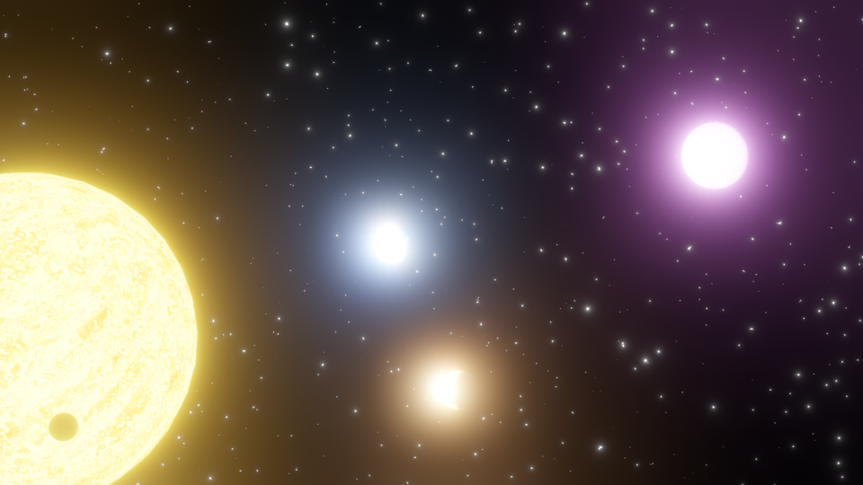
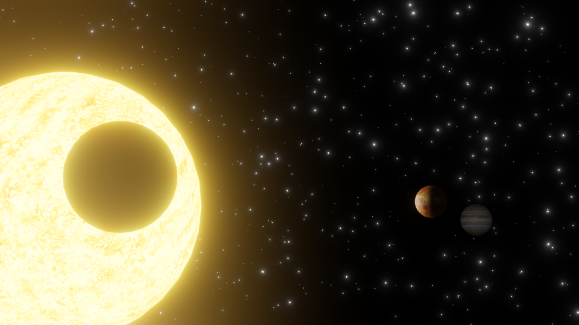
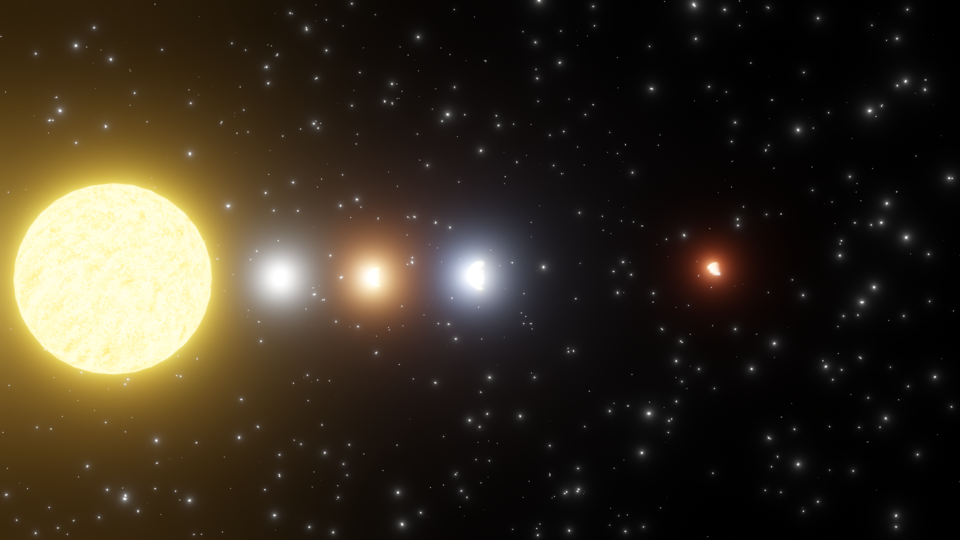
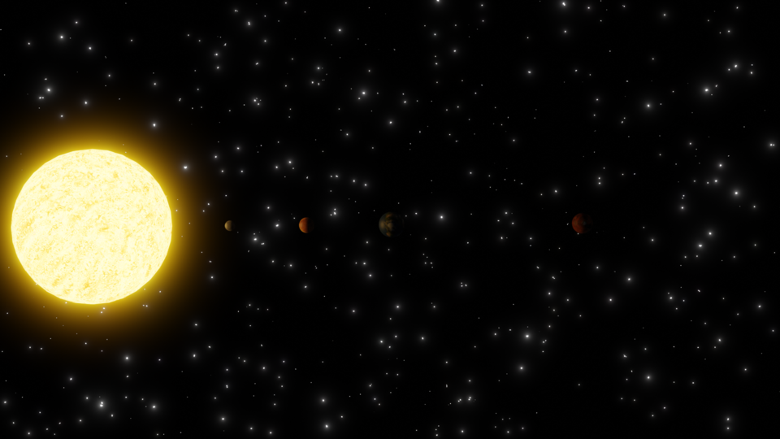
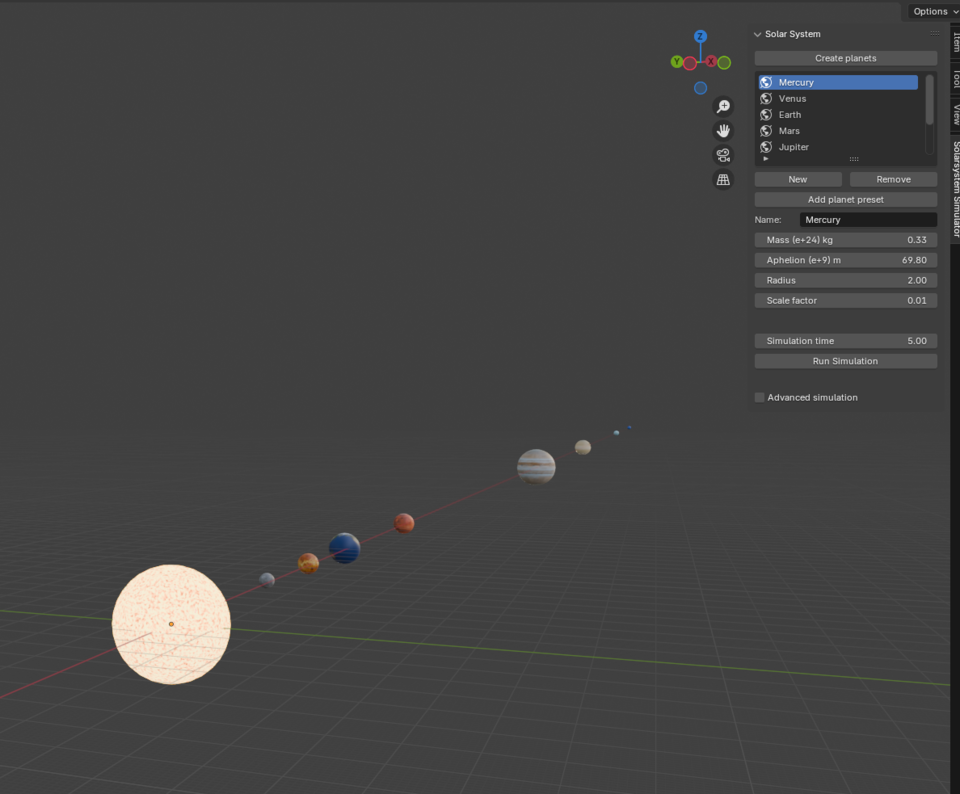
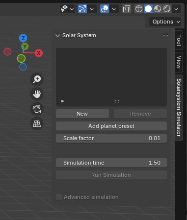

# BlenderSolarsystemSim
A solar system simulation using Euler approximation, animating each planet using keyframes and a custom UI to allow the user to create their own solar systems.

This project was done in 2024 for the course TNM085 - Modelling Project at LIU, made by Jonatan Ebenholm, Berkay Orhan, Ludwig Boge, and Nikita Sidarovich. Its purpose was to first simulate a number of planets revolving around a sun, and then visualise it. The code has since been changed to match new standards in blender python, mainly the names of different nodes in the shader changed. 

The project can be viewed ether by wathing the pretty images below, or by installing the zip-file and adding it as an addong to a blender project. This can be done by making new general project, pressing the edit button up in the top left, pressing preferences button clicking on add-ons in the pop up menu. Lastly, click the arrow in the top right to bring down a menu and press "install from disk". Choose the zip file, and you're done! Now, if you press n on your keyboard while in the workspace, the sidebar will show up. Navigate to the Solarsystem Simulator and start simulating!

Note: If you are using this in a project you've been working on, make sure to keep a backup, especially if you are running the advanced simulation version. There was an issue that we believe we have solved, that removed other objects in the scene when pressing the "create planes" button. Again, it is most likely solved, but might still fail in some undiscovered edge case. As for the advenced simulation option, it simply is expensive, exponentially so. This is to say, you might not have the time to wait for it to finnish, so if that's the case, make sure to save your project in case you have to force it shut, or better yet keep a backup of the project!

Here are some of the resulting images, but keep in mind that the simulation also does keyframe animations, so these images are just some frames of animation with some different lighting and camera angels. To see the animations, you can check out the addon by yourself. have fun!

## [GitHub](https://github.com/Sahriz/BlenderSolarsystemSim)

## [Back To Start Page](/)

