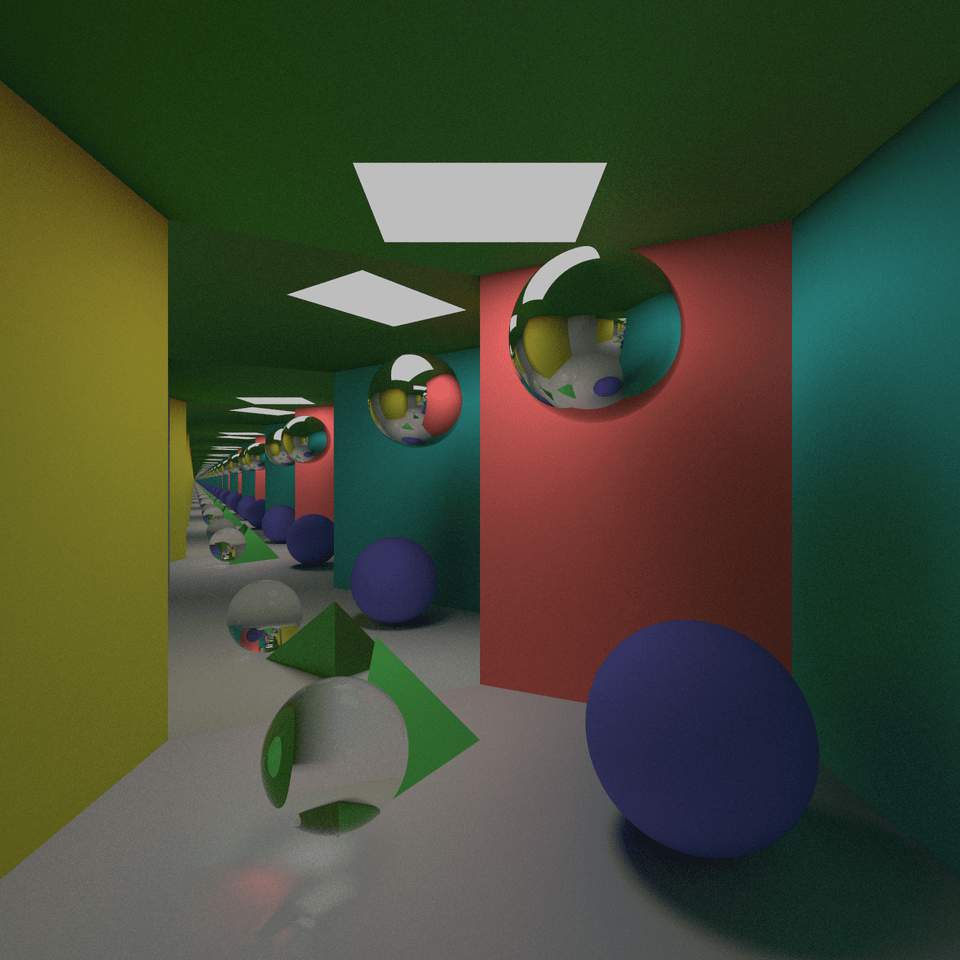

# Path Tracer on CPU

## Overview
This project is part of the course *TNCG15 - Advanced Global Illumination And Rendering*. The project is a system that is built from the ground up using C++, with the only dependancies being a header file including an kd-tree structure for finding caustic photons, and glm for their predefined vec3's with vector math. The project features are many, including the camera implemented, the geometry in the scene, and many many more things talked about below. 

## Features
- **Camera Class**: The camera class handles all the rendering and the ray logic. It shoots out rays on a plane, with the center of a pixel as its' target, then it lets the ray bounce in the room and colors the pixel appropriately. The camera also uses supersampling to get rid of aliasing effects in the rendered image. 
**Objects**: There are a couple objects that can be put into the scene, most are made up of triangles, which are made of vertices and a normal vector, but the sphere object is made using a parametric description, making the surface super smooth.
- **Intersection testing**: The course went through three different types of intersections, two of which were for triagnles, but one was far more supperior. The more superior option for triangle intersections, which we used, was the möller trumbore intersection test. The second intersection test is a bit more detailed and is explained in our report, linked down below.
- **Ray class**: The ray class defines a light ray, which is used to calculate the final output color of a pixel.
- **Surfaces**: The system has four different surfaces. The first are lambertian surfaces, the second are reflective surfaces, the fifth are refractive surfaces, and finally there is the light sources.

## Technologies Used
- **C++**: An object oriented programming language.  
- **glm**: A library generally used in combination with openGL, but in this project it is used for easy access to vector math. 
### Final render, with refractive, reflective, lambertian and light surfaces. 

## [Back To Start Page](/)

