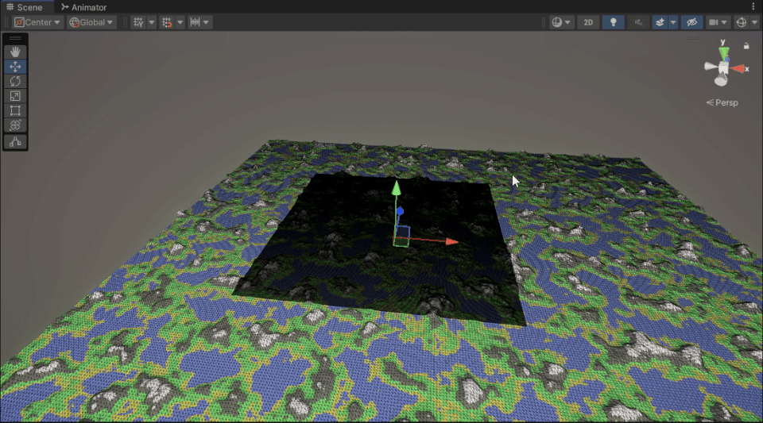
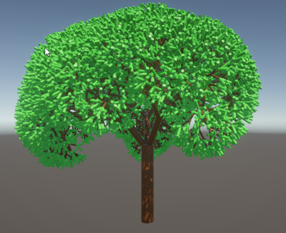
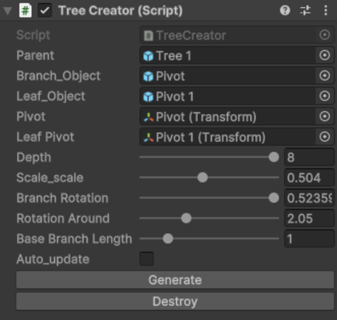

# Inifinite World

## Overview
This project is part of the course *TNM084 - Procedural methods for images*. It is an Unity system which generates chunks of terrain while the user moves around in the world using perlin noise. It also hosts an L-system which is used for tree creation, altough they are not very efficient for realtime rendering.

## Features
- **Real time world generation**: The system generates the world with minimal lag using a chunk system, only generating new chunks when needed and loading/unloading them when they enter and leave view distance.
**Perlin Noise**: The chunks all use perlin noise to create a heightmap, describing the height of every vertex point on the mesh which the chunk holds.
- **Real-time Data**: The world has mesh colliders which gives the world interactable physics, which can be seen in an image below.
- **LOD**: Level of detail is different for chunks depending on the distance from the player. This can be seen in an image below.
- **L-System Trees**: The system includes an L-system for creating custom trees with a press of a button. These ended up not being used during gameplay, as the trees themselves don't make for easy to render game objects. That in combination with wanting hundreds if not even thousands of trees in the game scene meant that they were not a great fit. An example of a tree and the UI with the settings used to create the tree is shown in another image below.

## Technologies Used
- **Unity**: An all purpose game engine which hosts powerfull tools for most usecases.  
### The world generating as the player moves around

### Physics on the worlds surface

### The LOD in action

### The L-system tree and the settings to create it with my custom UI

## [Back To Start Page](/)

