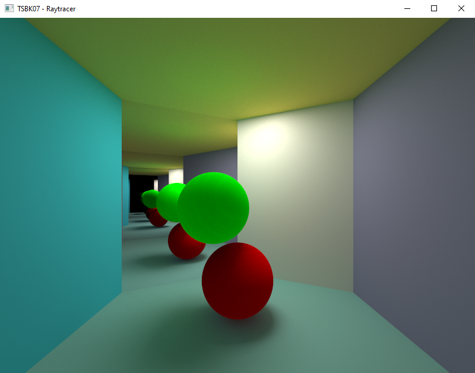
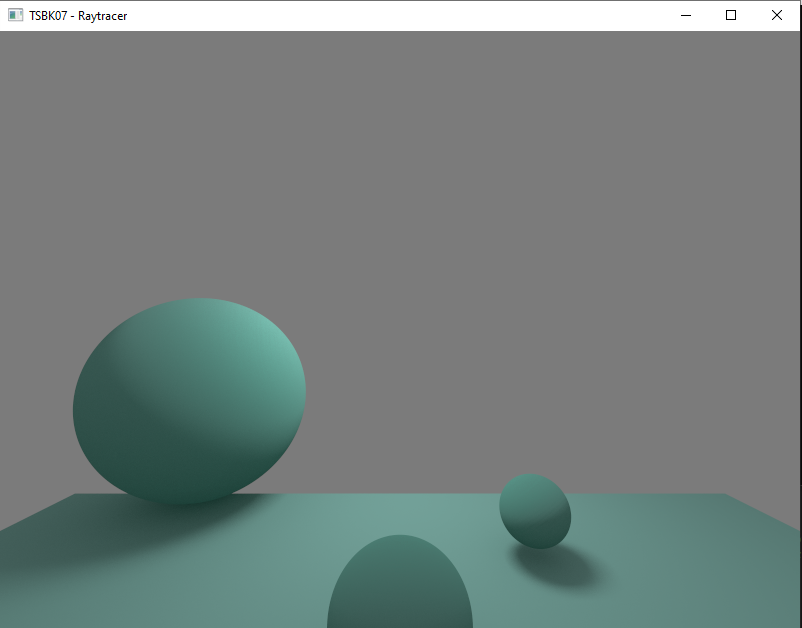

# RayTracer on GPU

## Overview
This project is a WIP follow up project of the CPU raytracer, where me and Ludwig Boge are tackling the difficulties that comes with creating a path tracer on the GPU. The project is for the course **TSBK - Computer Graphics** and is supposed to start in late March, but we took initiative and started the project now in january, since we are very passionate about the subject. The shader is mostly written within the shader code, which is limiting, and gives equal results to that of the CPU path tracer but at a bit more than 10000 times more frames per second.

## Features
- **Real time Path Tracing**: The big difference with this project and the one for the CPU is the amount of frames we generate here. The GPU path tracer is currently, without optimisations that will come later, rendering at a solid 14 frames per second on my 1070. However, since this is a WIP project, we will add more optimisations in the future to boost this further (such as BVH among other things). 

## Technologies Used
- **C++**: An object-oriented programming language. C++ is a superset of the C language.
- **OpenGL**: A cross-language, multi-platform API for rendering 2D and 3D vector graphics.
### Some example images and gifs

## [GitHub](https://github.com/eLdOchLagor/TSBK07-Raytracer)

## [Back To Start Page](/)

