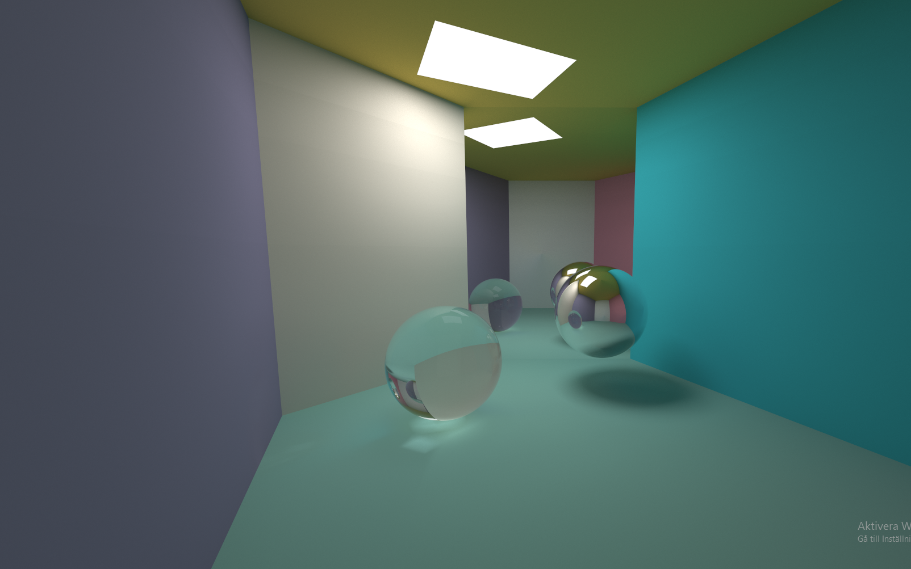

# PathTracer on GPU

## Overview
This project was done for the course **TSBK07 - Computer Graphics** at LIU. The project is a path tracer with multiple scenes which showcases its power. There are diffuse, reflective and transmissive materials, all seen in scene 0. The path tracer has also been optimised to be able to handle a large amount of polygons, as seen in scene 3, where the stanford bunny with tens of thousand of triangles is rendered in real time on computors with somewhat decent hardware. Due to course restrictions, a library written by **ingemar Ragnemalm** was used instead of glm. The project was done together with *Ludwig Boge*.
****
## Features
- **Real time Path Tracing**: Real time path tracing utilizing the GPU and with BVH-trees to render large scale models at high frame rate. 
****
## Technologies Used
- **C++**: An object-oriented programming language. C++ is a superset of the C language.

- **OpenGL**: A cross-language, multi-platform API for rendering 2D and 3D vector graphics.

- **VectorUtils4**: glm-like header file library which was mandatory for the course, otherwise glm would have been used.
****

## Some example images and videos

### A render of the room scene

### Closeup of the mirror sphere next to another mirror surface

### Moving around in the scene
<video src="../../images/TSBK07/PathTracerMovement.webm"></video>

### Stanford bunny rendered with 70k triangles
<video src="../../images/TSBK07/PathTracer.webm"></video>

### Different amount of light bounces
<video src="../../images/TSBK07/PathTracerFront.webm"></video>
****
The report can be read [here](../../images/TSBK07/TSBK07___Pathtracer_with_BVH.pdf).

****

## [GitHub](https://github.com/eLdOchLagor/TSBK07-Raytracer)

## [Back To Start Page](/)

