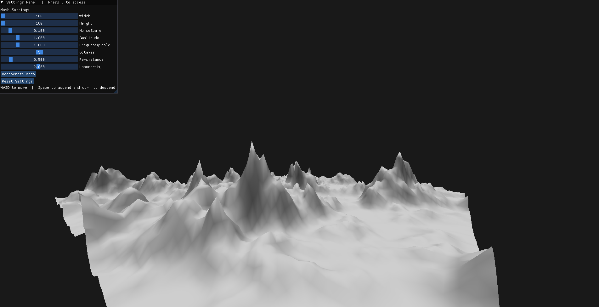
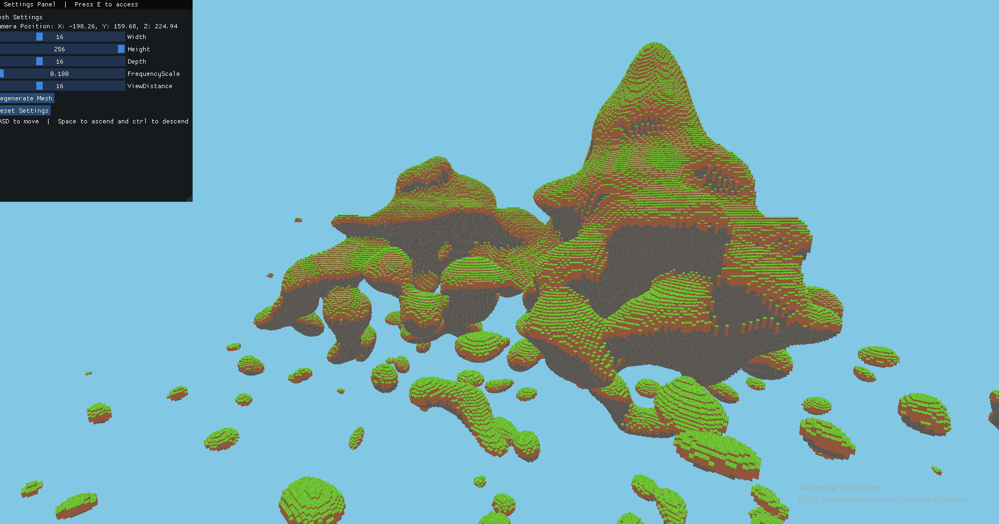

# Terrain Library for c++

## Overview
This project is a WIP library for personal use, but open for anyone to use or modify. Its purpose is to have a plethora of easy single call functions that can generate terrain for future game projects that I might have, and for debugging and testing purposes has demos to show the intent and possible use of the library.
****
## Current Features
- **Heightmap generation on CPU or GPU**: The CPU and GPU implementation are very similar, but the GPU version is of course working on the terrain in parallel. The heightmap uses simple gradient noise by
*patriciogonzalezvivo* on [GitHub](https://gist.github.com/patriciogonzalezvivo/670c22f3966e662d2f83) as a way of displacing vertices on a plane mesh to create terrain. There are two demos of the height maps, one which shows the effect of noise on the terrain, and one which shows the terrain being rendered and created in chunks.

- **Marching Cubes 3D terrain Generation on CPU or GPU**: The CPU and GPU implementation are again very similar, but the GPU version works in parallel. The noise used for the marching cubes algorithm is a 3D gradient noise, simplex noise in fact, which was also fetched from *patriciogonzalezvivo* on [GitHub](https://gist.github.com/patriciogonzalezvivo/670c22f3966e662d2f83). The noise in this algorithm functions not as a way to displace vertices, but instead as a way of defining which parts of a grid are "solid" or "air", and if there is a transition, the marching cubes algorithm will interpolate positions for vertices. There is one demo showing of the algorithm and it works by chunking just like one of the heightmap demos. The look-up tables needed for the algorithm were taken from [this article](https://paulbourke.net/geometry/polygonise/) by Paul Bourke in May 1994. 

- **VoxelCube terrain Generation on GPU**: This part of the project is by far the most impressive part, since a lot of time has been put into creating terrain that is game ready. The algorithm works similarly to the marching cubes one in that it is a voxel engine, but the actual terrain creation (vertex placement, normals creation etc...) is much simpler. What makes this part of the project stand out is the advanced techniques used in shaping the terrain. It layers multiple different noise maps with different splines, to combine 2D noise with 3D noise which comes together to create extreme mountains, groves, flat land and vast cave systems. This terrain can both be used to create visuals, but the data can also be used for physics interaction, which is where the project will be taken in the future to gamefy it. This project has one demo currently.
****
## Technologies Used
- **C++**: C++ is a high level, general-purpose programming language.
- **OpenGL Graphics pipeline**: OpenGL (Open Graphics Library) is a cross language, cross-platform API for rendering 2D and 3D vector graphics. Typically used for graphics, the render pipeline works almost entirelly on the GPU, allowing for super fast rendering.
- **OpenGL ComputeShaders/Gpu Programming**: Compute shaders have been core to OpenGL since version 4.3, and are a way to program using the GPU as opposed to the CPU, which allows for parallel programming which can speed up certain tasks by making the task go from a linear time complexity to a constant time complexity (kind of).
- **Premake**: A build language that helps set up the paths for the c++ program. 
****
## A showcase of the heightmap terrain:
### This is the standard settings for a chunk as I have defined it. It creates a plane as such.**

### This following image showcases the plane in a lower resolution (fewer vertices).**

### The next image shows the effect of having a higher frequency applied on the gradient noise which displaces the vertices.**

### This final image of the heightmap terrain showcases what a chunking system of the terrain could look like.**

****
## A showcase of the marching cubes terrain:

<video src="../../images/TerrainLib/mcubes2.webm"></video>
****

## A showcase of the Voxelcubes terrain:

****

## TODO List for Library
- **Make the splines more customisable for VoxelCubes**
- **Add biome system to VoxelCubes** 

## TODO List for VoxelCube Game
- **Implement a debug mode for testing noise changing**
- **Make physics work for player controller**
- **Make a state machine for player character**
- **Allow interaction with terrain by for example detroying terrain**

## [Back To Start Page](/)

